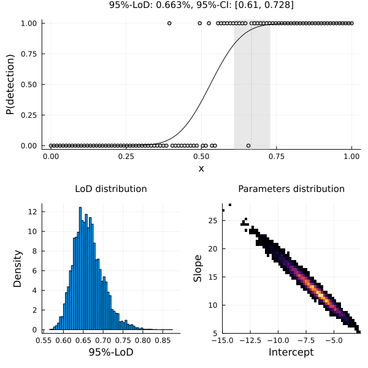

# LimitOfDetection.jl

[](https://github.com/jonathanBieler/LimitOfDetection.jl/actions/workflows/CI.yml?query=branch%3Amain)
[](https://codecov.io/gh/jonathanBieler/LimitOfDetection.jl)


### Introduction

The limit of detection (LoD) is the lowest value of a variable `x` at which an event can 
be detected with a given sensitivity. For example, a smoke detector that triggers at a
concentration of 15,000 particles per cm^3 with 95% probability has a 95%-LoD of 15,000.

This package uses a probit or logit model from the [GLM](https://github.com/JuliaStats/GLM.jl) package to estimate the LoD, taking as input a vector
containing the values of the variable considered (e.g. smoke concentration) and the corresponding boolean detection status (`true` = detected). 
In addition it performs sampling using [AdaptiveMCMC](https://github.com/mvihola/AdaptiveMCMC.jl) to provide error estimates on the LoD, and
a plot recipee is provided to visualize the results.



### Usage

```julia
using LimitOfDetection

# generate artificial data   
x = LinRange(0,1,100)
link = ProbitLink()
f = x -> LimitOfDetection.GLM.linkinv(link, 10*x - 5)
Pcall = f.(x) 
detected = [rand() < P for P in Pcall]

# fit model
model = fit(LoDModel, x, detected; Nsamples = 50_000, sensitivity = 0.95, link = ProbitLink())
    
julia> model
Limit of Detection:
────────────────────────────────────────────────────────────
              MLE      Mean        Std  Lower 90%  Upper 90%
────────────────────────────────────────────────────────────
95%-LoD  0.670671  0.670189  0.0134975   0.648664   0.693332
────────────────────────────────────────────────────────────

julia> using Plots; plot(model; CI_level = 0.9, label = "x")
```

#### Methods

```julia
MLE(model) # returns the maxmimum-likelihood estimator of the LoD
mean(model) # returns the mean aposteriori of the LoD
quantile(model, q) # returns the quantile q of the posterior distribution
```
